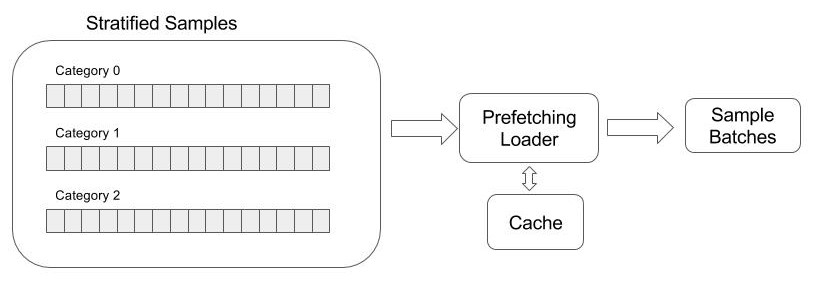

# Streaming Pipeline



### Stratefied Sampling

When stratified sampling is enabled (`config.stratify=True`), all samples are
first organized into categories by their labels (must be integral).  Images are
then sampled from each category in round-robin order to make a stream.  When
loop is enabled (`config.loop=True`), a category automatically rewinds with
optional re-shuffling (`config.reshuffle=True`), producing an endless stream
with equal proportion of each category.  When loop is disabled, a category is
removed from round-robin when all its samples are consumed.

When stratified sampling is disabled, all records are considered
to be in a single category.

### Splitting and Cross-Validation

When splitting is enabled, records in each stratified category
is first divided into K partitions (`config.split = K`), with the partition
specified by `config.split_fold` removed. However, if `config.split_negate` is true,
then only the partition specified by `config.split_fold` is retained.
This splitting and data picking happens before streaming begins.
Set `config.shuffle=True` to do random shuffle before K-fold splitting.

K-fold cross validation can be carried out by

1. Specify config.split = K.
2. Run the training-validation process for K times, with
`config.split_fold` looping from 0 to K-1.
3. Run training with config.split_negate = False, and then
validation with `config.split_negate = True`.


A PicPac streamer class keeps its own random number generator.
So long as `config.seed` is the same, data splitting is guaranteed
to happen in the same way.

### Decoding & Augmentation

A prefetching loader reads raw records from the above
s stratified sample pool and process each records with the
following steps:

1. Decode the image, optionally limiting the image size
to a given range (`config.max_size`, `config.min_size`).

2. If annotation is enabled, render the JSON annotation
(`config.annotate = "json"`) or decode the annotation image.
(`config.annotate = "image").

3. Optionally save image and annotation to cache (`config.cache = True`),
so the same record is seen again no disk reading and decoding has to be done.

4. When augmentation is enabled (`config.perturb` = True), the image
and annotation are randomly perturbed in the same way.

A thread pool (`config.threads`) is used for decoding and augmentation.

# Generic Streaming API

```python
import picpac

config = dict(loop=True,   # restart from beginning when all data consumed
                           # this leads to an endless loop.
         batch=16,
         # with batch > 0, images in the same batch must be of the same size
         # use resize_width/height if raw images have different sizes
         resize_width=256,
         resize_width=256,
	 )

stream = picpac.ImageStream('path_to_db', **config)

for images, labels, pad in stream:
    # do something with images and labels
    pass
```

For each batch, images is a 4-dimensional tensor of the shape (batch_size, channels, rows, cols).
Depending on configuration, labels can be of one of the following four sizes:

- (batch_size): neither "annotate" or "onehot" is set.  The raw float label returned.
- (batch_size, classes): "annotate" is not set, "onehot" is set to number of classes. The raw float label is interpreted as class ID, and therefore must be integral.
- (batch_size, 1, rows, cols): "annotate" is set and "onehot" is not set; for pixel-level regression.
- (batch_size, classes, rows, cols): both "annotate" and "onehot" are set; for pixel-level classification.  One-hot
encoding is done assuming pixel value is the integral class ID.

When `config.loop is False`, and the remaining samples are not enough to make up a whole batch,
the streamer will throw StopIteration if `config.pad is False`, or return a batch with random
padding otherwise.  When the latter happens, the `pad` value returned gives the number of
padding samples.  In all other cases, `pad` is always 0.

# MXNet

```
from picpac.mxnet import ImageStream


# create ImageStream using the same configuration parameters
# picpac.mxnet.ImageStream is inherited from mxnet.io.DataIter

```

# Neon

```
from picpac.neon import ImageStream

# create ImageStream using the same configuration parameters
# picpac.meon.ImageStream is inherited from neon.data.dataiterator.NervanaDataIterator

```

# Caffe

Use this [Caffe FCN fork](https://github.com/aaalgo/caffe-picpac).

```
layer {
  name: "data"
  type: "PicPac"
  top: "data"
  top: "label"
  picpac_param {
    path: "path_to_db"
    batch: 16
    channels: 3
    split: 5
    split_fold: 0
    resize_width: 224
    resize_height: 224
    threads: 4
    perturb: true
    pert_color1: 10
    pert_color2: 10
    pert_color3: 10
    pert_angle: 20
    pert_min_scale: 0.8
    pert_max_scale: 1.2
  }
}

```

Note that the above specification always go through the following touchup:
```
  config_.loop = true;
  if (this->phase_ == TRAIN) {
      config_.reshuffle = true;
      config_.shuffle = true;
      config_.stratify = true;
      config_.split_negate = false;
  }
  else {
      config_.reshuffle = false;
      config_.shuffle = true;
      config_.stratify = true;
      config_.split_negate = true;
      config_.perturb = false;
      config_.mixin.clear();
  }

```

The default behavior of Caffe is one-hot encoding, so do not specify onehot in configuration.


